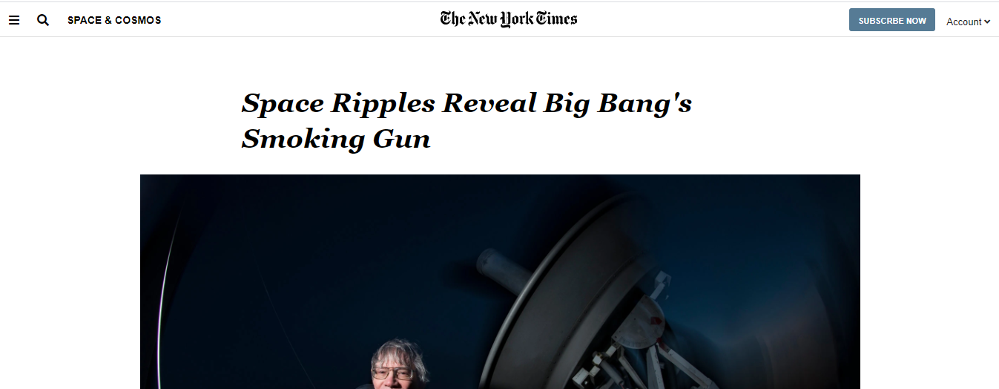
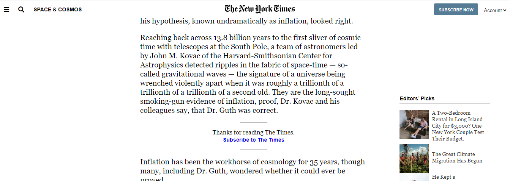

# A clone of the New York Times article page

This project is based on The Odin Project and Microverse peer programming collaborative coding. It involves cloning a page that matches the look of a [certain New York times article page](https://www.nytimes.com/2014/03/18/science/space/detection-of-waves-in-space-buttresses-landmark-theory-of-big-bang.html?_r=0)

This is a collaborative project carried out by Bello Babakolo and Oluwaseun Iyadi, as part of the PROJECT: POSITIONING AND FLOATING ELEMENTS. This project is aimed at learning and using CSS Positoning properties such as floats, flex, and grid to style web pages.

## Built With
- HTML5
- CSS3
- Google Icons
- SVG sources, images and videos links in the original web page

## Live Demo

[Live Demo Link](https://raw.githack.com/belsman/POSITIONING-AND-FLOATING-ELEMENTS/master/index.html)

## Getting Started

**To get your own copy of our project clone the repository to your local machine.**

## Authors

👤 **Bello Babakolo**

- Github: [@belsman](https://github.com/belsman)
- Twitter: [@d_belsman](https://twitter.com/d_belsman)
- Linkedin: [Bello Babakolo](https://linkedin.com/bello-babakolo-b23b17145)

👤 **Oluwaseun Iyadi**

- Github: [@CornerstoneII](https://github.com/CornerstoneII)

## 🤝 Contributing

Contributions, issues and feature requests are welcome!

Feel free to check the [issues page](issues/).

## Show your support

Give a ⭐️ if you like this project!

## 📝 License

This project is [MIT](lic.url) licensed.
